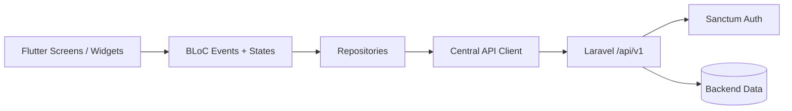

# Homvaro Flutter App

Homvaro is a Material 3 Flutter client for a Laravel rental-management API. The production app uses explicit BLoC events and states, a centralized HTTP client, Laravel Sanctum bearer authentication, and secure token storage.

It is built around real owner/renter workflows rather than generated demo data.

## Supported Workflows

### Owner

- Property creation and editing
- Publication-status changes
- Multipart image and video uploads
- Rental application review
- Tenancy creation and terms management
- Monthly record review, freeze, and reopen flows
- Maintenance status transitions and history

### Renter

- Listing discovery and property details
- Rental applications
- Tenancy history
- Monthly record drafts and submissions
- Proof uploads
- Maintenance requests, comments, and history

### Shared

- Authentication with `identifier`, `password`, and `device_name`
- `/me` session restoration
- Role-aware routing
- Logout and global 401/session-expiry handling
- Role-aware notifications with read/unread state
- Shared loading, empty, retry, API-error, and status states
- Laravel 422 field-error parsing and readable validation messages

Favorites are intentionally absent because the Laravel API does not expose a favorites endpoint under `/api/v1`. Property deletion and existing property-media deletion are also omitted because their API routes do not exist. The supported media-upload contract is fully integrated.

## Architecture



```text
lib/
├── core/
│   └── api/
├── repositories/
├── features/
├── models/
├── screens/
└── widgets/
```

Key responsibilities:

- `lib/core/api/app_api_client.dart` — `/api/v1` requests, multipart uploads, paging, timeouts, network errors, Laravel errors, and 401 events
- `lib/repositories` — authentication and feature data boundaries
- `lib/features` — event/state/BLoC modules for API-backed features
- `lib/models/entities.dart` — defensive Laravel resource parsing and enums
- `lib/screens` — role-gated Owner and Renter workflows
- `lib/widgets` — shared status, error, loading, card, and media UI

## Engineering Focus

This project demonstrates:

- role-aware mobile architecture
- REST API integration against an existing backend contract
- authentication/session recovery
- BLoC-based state management
- multipart media uploads
- defensive API parsing
- centralized error handling
- business workflows that match backend capabilities instead of inventing unsupported client behavior

## Run Locally

The Android emulator reaches a Laravel server on the host through the default base URL `http://10.0.2.2:8000`:

```bash
flutter pub get
flutter run
```

Override it for a physical device or another environment:

```bash
flutter run --dart-define=RENTRA_API_BASE_URL=http://192.168.1.10:8000
```

The configured value may include or omit `/api/v1`; the client normalizes it.

## Verification

```bash
flutter pub get
dart format .
flutter analyze
flutter test
flutter build apk --debug
```

## Portfolio Note

Homvaro is maintained as a portfolio example of a production-style Flutter client consuming a Laravel API with real role-based rental workflows.
